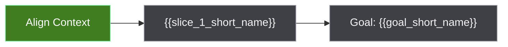

# {{goal_name}} Diagram

## How To Read

The diagram shows the agreed goal path and slice checkpoint status. Green means
done, blue means active, gray means pending, and red means blocked.

## Text Checkpoints

| Checkpoint | Status | Notes |
| --- | --- | --- |
| Align Context | done | Goal and slices agreed. |
| {{slice_1_short_name}} | pending | {{slice_1_note}} |
| Goal: {{goal_short_name}} | pending | Final goal is not complete yet. |
