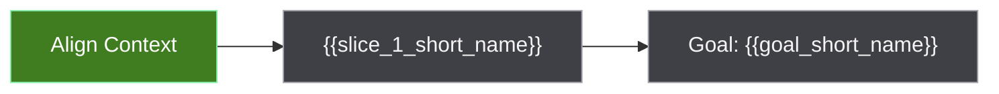

# Task Memory Implementation Plan

> **For agentic workers:** REQUIRED SUB-SKILL: Use superpowers:subagent-driven-development (recommended) or superpowers:executing-plans to implement this plan task-by-task. Steps use checkbox (`- [ ]`) syntax for tracking.

**Goal:** Add Compass task memory rules and templates so long multi-slice work can preserve goal, slice, diagram, and memory context under a target project's `docs/.tasks/` directory.

**Architecture:** Keep the existing reference-driven Compass skill shape. Put structured behavior rules in `references/task-memory.xml`, reusable markdown shapes in `assets/docs-seed/_templates/`, and skill-facing load rules in `SKILL.md`. Update repository docs to explain where task memory belongs and how it is verified.

**Tech Stack:** Markdown, XML, POSIX shell, existing `scripts/bootstrap-docs.sh`.

---

## File Structure

- Create `references/task-memory.xml`: structured source of truth for trigger rules, folder shape, statuses, lifecycle, resume behavior, and Mermaid color rules.
- Create `assets/docs-seed/_templates/task-goal.md`: reusable template for `docs/.tasks/<task>/goal.md`.
- Create `assets/docs-seed/_templates/task-diagram.md`: reusable template for `docs/.tasks/<task>/diagram.md`.
- Create `assets/docs-seed/_templates/task-memories.md`: reusable template for `docs/.tasks/<task>/memories.md`.
- Modify `SKILL.md`: load task memory rules during long multi-slice tasks, include templates in seed-doc checks, and state creation/update gates.
- Modify `README.md`: describe task memory as a Compass capability.
- Modify `docs/architecture/existing-architecture-lock.md`: record task memory as target-project docs context, not a new root architecture.
- Modify `docs/process/existing-process-lock.md`: add implementation and verification workflow notes for task memory.
- Modify `docs/reference/README.md`: list `references/task-memory.xml` as a structured reference.

## Task Breakdown

### Task 1: Add Structured Task Memory Reference

**Files:**
- Create: `references/task-memory.xml`

- [ ] **Step 1: Create the XML reference**

Create `references/task-memory.xml` with this exact content:

```xml
<?xml version="1.0" encoding="UTF-8"?>
<task-memory-reference>
  <purpose>Preserve aligned goal, slice, diagram, and memory context for long Compass-guided work when LLM context may be lost or compressed.</purpose>

  <activation>
    <rule>Do not create task memory for every task.</rule>
    <rule>Create task memory only for long or risky multi-slice work.</rule>
    <rule>The task type or discovered risk must suggest long-running work, such as new_feature, architecture_change, large refactor, or another task with meaningful checkpoint risk.</rule>
    <rule>Compass must have at least two concrete implementation slices after align-context or fit-design.</rule>
    <rule>Create task memory after the developer and agent have aligned on the goal and slices, and before the first implementation slice starts.</rule>
    <rule>If the task has only one implementation slice, do not create task memory unless the developer explicitly asks for it.</rule>
  </activation>

  <location>
    <root>docs/.tasks</root>
    <folder-format>YYYYMMDD-HHMM_goal-slug</folder-format>
    <required-file>goal.md</required-file>
    <required-file>diagram.md</required-file>
    <required-file>memories.md</required-file>
  </location>

  <goal-statuses>
    <status name="active">The goal is currently in progress.</status>
    <status name="completed">The goal is finished and verified.</status>
    <status name="superseded">The goal was replaced by a new goal.</status>
    <status name="cancelled">The goal stopped without a replacement.</status>
  </goal-statuses>

  <slice-statuses>
    <status name="pending" color="gray">The slice is planned but not started.</status>
    <status name="active" color="blue">The slice is currently being worked on.</status>
    <status name="done" color="green">The slice is complete and verified.</status>
    <status name="blocked" color="red">The slice cannot proceed until a blocker is resolved.</status>
  </slice-statuses>

  <files>
    <file name="goal.md">
      <purpose>Source of truth for goal identity, status, description, non-goals, success criteria, slice list, links to superseded or successor goals, and latest evidence.</purpose>
      <rule>Update goal.md whenever the goal status, slice list, slice status, blocker, successor link, or latest evidence changes.</rule>
    </file>
    <file name="diagram.md">
      <purpose>Human-readable checkpoint visualization using Mermaid plus text support.</purpose>
      <rule>Include status legend and a text fallback so the checkpoint map remains readable when Mermaid is not rendered.</rule>
      <rule>Update the Mermaid diagram whenever goal.md or memories.md changes slice or goal state.</rule>
    </file>
    <file name="memories.md">
      <purpose>Summaries and reverse-chronological histories for context recovery.</purpose>
      <rule>Keep SUMMARIES current with the latest compressed state.</rule>
      <rule>Keep HISTORIES newest first.</rule>
      <rule>The LLM memikirkan field must contain a rationale snapshot, not private chain-of-thought.</rule>
    </file>
  </files>

  <lifecycle>
    <event name="created">Create all required files after align-context or fit-design and before the first implementation slice.</event>
    <event name="slice-started">Mark the slice active in goal.md, update diagram.md to blue, and add a memory history entry.</event>
    <event name="slice-completed">Mark the slice done in goal.md, record evidence, update diagram.md to green, and add a memory history entry.</event>
    <event name="slice-blocked">Mark the slice blocked in goal.md, record the blocker, update diagram.md to red, and add a memory history entry.</event>
    <event name="slice-changed">If the goal remains stable, update the existing task folder instead of creating a new folder.</event>
    <event name="goal-changed">Create a new task folder, mark the old goal superseded, cross-link both goals, and record the reason in both memories.md files.</event>
    <event name="goal-completed">Mark the goal completed and record final evidence.</event>
  </lifecycle>

  <resume>
    <rule>At the start of a long Compass-guided task, inspect docs/.tasks for active relevant goals before creating a new task memory folder.</rule>
    <rule>If exactly one active relevant goal exists, load goal.md, diagram.md, and memories.md before planning or implementation.</rule>
    <rule>If multiple active goals could match, ask one clarification question before choosing.</rule>
    <rule>If an active goal conflicts with the user's new request, treat that as a potential goal change and ask before superseding it.</rule>
  </resume>

  <mermaid>
    <rule>Use flowchart diagrams for checkpoint flow unless the user asks for another Mermaid type.</rule>
    <rule>Use class definitions for pending, active, done, and blocked states.</rule>
    <rule>Use short node labels and explain detail in surrounding text.</rule>
    <class name="pending" fill="#3f3f46" stroke="#a1a1aa" color="#f4f4f5" />
    <class name="active" fill="#0284c7" stroke="#7dd3fc" color="#ffffff" />
    <class name="done" fill="#3f7d20" stroke="#86efac" color="#ffffff" />
    <class name="blocked" fill="#b91c1c" stroke="#fca5a5" color="#ffffff" />
  </mermaid>
</task-memory-reference>
```

- [ ] **Step 2: Validate the XML reference**

Run:

```bash
xmllint --noout references/task-memory.xml
```

Expected: command exits with status 0 and prints no output.

- [ ] **Step 3: Commit Task 1**

Run:

```bash
git add references/task-memory.xml
git commit -m "feat(compass): add task memory reference"
```

Expected: commit succeeds and includes only `references/task-memory.xml`.

### Task 2: Add Task Memory Templates

**Files:**
- Create: `assets/docs-seed/_templates/task-goal.md`
- Create: `assets/docs-seed/_templates/task-diagram.md`
- Create: `assets/docs-seed/_templates/task-memories.md`

- [ ] **Step 1: Create `task-goal.md`**

Create `assets/docs-seed/_templates/task-goal.md` with this exact content:

```markdown
---
type: task-goal
status: active
owner: engineering
created: "{{datetime:YYYY-MM-DD HH:mm TZ}}"
updated: "{{datetime:YYYY-MM-DD HH:mm TZ}}"
parent: "[[docs/.tasks]]"
tags:
  - docs/tasks
  - status/active
goal_id: "{{goal_id}}"
goal_status: active
previous_goal:
next_goal:
aliases:
related:
---

# {{goal_name}}

## Status

`active`

## Description

{{goal_description}}

## Non-Goals

- {{non_goal}}

## Success Criteria

- {{success_criterion}}

## Slices

| Slice | Status | Purpose | Evidence |
| --- | --- | --- | --- |
| {{slice_id}} - {{slice_name}} | pending | {{slice_purpose}} | {{slice_evidence}} |

## Latest Evidence

- {{latest_evidence}}

## Goal Links

- Previous goal: {{previous_goal_link}}
- Next goal: {{next_goal_link}}
```

- [ ] **Step 2: Create `task-diagram.md`**

Create `assets/docs-seed/_templates/task-diagram.md` with this exact content:

````markdown
---
type: task-diagram
status: active
owner: engineering
created: "{{datetime:YYYY-MM-DD HH:mm TZ}}"
updated: "{{datetime:YYYY-MM-DD HH:mm TZ}}"
parent: "[[docs/.tasks/{{task_folder}}/goal]]"
tags:
  - docs/tasks
  - status/active
goal_id: "{{goal_id}}"
related:
  - "[[docs/.tasks/{{task_folder}}/goal]]"
  - "[[docs/.tasks/{{task_folder}}/memories]]"
---

# {{goal_name}} Diagram

## How To Read

The diagram shows the agreed goal path and slice checkpoint status. Green means
done, blue means active, gray means pending, and red means blocked.



## Text Checkpoints

| Checkpoint | Status | Notes |
| --- | --- | --- |
| Align Context | done | Goal and slices agreed. |
| {{slice_1_short_name}} | pending | {{slice_1_note}} |
| Goal: {{goal_short_name}} | pending | Final goal is not complete yet. |
````

- [ ] **Step 3: Create `task-memories.md`**

Create `assets/docs-seed/_templates/task-memories.md` with this exact content:

```markdown
---
type: task-memory
status: active
owner: engineering
created: "{{datetime:YYYY-MM-DD HH:mm TZ}}"
updated: "{{datetime:YYYY-MM-DD HH:mm TZ}}"
parent: "[[docs/.tasks/{{task_folder}}/goal]]"
tags:
  - docs/tasks
  - status/active
goal_id: "{{goal_id}}"
related:
  - "[[docs/.tasks/{{task_folder}}/goal]]"
  - "[[docs/.tasks/{{task_folder}}/diagram]]"
---

# {{goal_name}} Memories

## SUMMARIES

{{conversation_summary}}

## HISTORIES

[{{datetime:YYYY-MM-DD HH:mm TZ}}]
User memikirkan:
{{user_thought_snapshot}}

LLM memikirkan:
{{llm_rationale_snapshot}}

Kesepakatan:
{{agreement_snapshot}}
```

- [ ] **Step 4: Verify templates exist**

Run:

```bash
test -f assets/docs-seed/_templates/task-goal.md
test -f assets/docs-seed/_templates/task-diagram.md
test -f assets/docs-seed/_templates/task-memories.md
```

Expected: all three commands exit with status 0 and print no output.

- [ ] **Step 5: Commit Task 2**

Run:

```bash
git add assets/docs-seed/_templates/task-goal.md assets/docs-seed/_templates/task-diagram.md assets/docs-seed/_templates/task-memories.md
git commit -m "feat(compass): add task memory templates"
```

Expected: commit succeeds and includes only the three new template files.

### Task 3: Wire Task Memory Into Compass Skill Policy

**Files:**
- Modify: `SKILL.md`

- [ ] **Step 1: Add the task memory templates to the seed docs checklist**

In `SKILL.md`, in the `First Run Bootstrap` seed document checklist, add these bullets after `docs/_templates/README.md`:

```markdown
- `docs/_templates/task-goal.md`
- `docs/_templates/task-diagram.md`
- `docs/_templates/task-memories.md`
```

- [ ] **Step 2: Add task memory to Project Docs Integration**

In `SKILL.md`, under `## Project Docs Integration`, add this paragraph after the existing bullet list of docs to read:

```markdown
For long or risky multi-slice work, inspect `docs/.tasks/` for an active relevant goal after reading the orientation and process docs. If one active relevant goal exists, read its `goal.md`, `diagram.md`, and `memories.md` before planning or implementation. If multiple active goals could match the request, ask one clarification question before selecting one. If an active goal conflicts with the user's request, treat that as a possible goal change rather than silently reusing or overwriting it.
```

- [ ] **Step 3: Add a Task Memory section**

In `SKILL.md`, add this section after `## Project Docs Integration` and before `## Language And Stack Adaptation`:

```markdown
## Task Memory For Long Multi-Slice Work

Compass uses task memory to preserve context for long or risky work that has multiple implementation slices. Task memory is not created for every task.

Load `references/task-memory.xml` when both conditions are true:

- the task type or discovered risk suggests long-running work, such as `new_feature`, `architecture_change`, large refactor, or another task with meaningful checkpoint risk
- after align-context or fit-design, Compass has at least two concrete slices that the developer and agent understand

When task memory is required, create `docs/.tasks/<YYYYMMDD-HHMM>_<goal_slug>/` in the target project before the first implementation slice starts. The folder must contain `goal.md`, `diagram.md`, and `memories.md`, based on the task memory templates from `docs/_templates/`.

Update task memory whenever a slice starts, completes, becomes blocked, changes, or whenever the goal changes. If slices change but the goal remains stable, update the same task folder. If the goal changes, create a new task folder, mark the old goal `superseded`, cross-link both goals, and record the reason in both memory histories.

Use these goal statuses only: `active`, `completed`, `superseded`, and `cancelled`.

Use these slice statuses only: `pending`, `active`, `done`, and `blocked`.

The `memories.md` file may include a rationale snapshot for `LLM memikirkan`, but it must not expose private chain-of-thought. Record assumptions, trade-offs, risks, and reasons that help a future agent resume safely.
```

- [ ] **Step 4: Add task memory to Quick Start**

In `SKILL.md`, in the `## Quick Start` ordered list, add this item after the item that reads `Build the project docs context from docs/ using the Project Docs Integration rules.`:

```markdown
5. For long or risky multi-slice work, inspect or create task memory using `references/task-memory.xml` after align-context or fit-design and before implementation starts.
```

Then renumber the following ordered items so the list remains sequential from `1` through the final item.

- [ ] **Step 5: Verify SKILL.md mentions task-memory reference and templates**

Run:

```bash
rg -n "task-memory.xml|task-goal.md|Task Memory For Long Multi-Slice Work|docs/.tasks" SKILL.md
```

Expected output contains all four search terms.

- [ ] **Step 6: Commit Task 3**

Run:

```bash
git add SKILL.md
git commit -m "feat(compass): wire task memory workflow"
```

Expected: commit succeeds and includes only `SKILL.md`.

### Task 4: Update Project Documentation For Task Memory

**Files:**
- Modify: `README.md`
- Modify: `docs/architecture/existing-architecture-lock.md`
- Modify: `docs/process/existing-process-lock.md`
- Modify: `docs/reference/README.md`

- [ ] **Step 1: Update README capability list**

In `README.md`, under `## What Compass Provides`, add this bullet after the project-owned workflow bullet:

```markdown
- **Task memory for long work**: multi-slice tasks can keep a durable `docs/.tasks/` goal, diagram, and memory artifact so future sessions resume from the same goal.
```

- [ ] **Step 2: Update README How It Works flow**

In `README.md`, under `## How It Works`, add this step after the step that reads `Read relevant project docs: orientation lock, architecture, foundation, process, module docs, and decisions.`:

```markdown
7. For long multi-slice work, inspect or create `docs/.tasks/<task>/` after goal alignment so context survives session changes.
```

Renumber the following steps so the list remains sequential.

- [ ] **Step 3: Update architecture lock**

In `docs/architecture/existing-architecture-lock.md`, under `## Protected Boundaries`, add this bullet:

```markdown
- Task memory artifacts for target projects belong under target project `docs/.tasks/`; task memory templates belong in `assets/docs-seed/_templates/`.
```

Under `## Allowed Folder Growth`, add this bullet:

```markdown
- Add hidden `docs/.tasks/` folders inside target projects only for long or risky multi-slice work after goal alignment.
```

- [ ] **Step 4: Update process lock**

In `docs/process/existing-process-lock.md`, under `## Design Workflow`, add this item after reading the active workflow:

```markdown
8. For long or risky work with 2+ concrete slices, load `references/task-memory.xml` and create or resume task memory after goal alignment.
```

Renumber or adjust the surrounding list so it reads cleanly.

Under `## Implementation Workflow`, add this paragraph:

```markdown
Long multi-slice work must keep task memory current. Before the first implementation slice, create or resume `docs/.tasks/<task>/`. At each slice boundary, update `goal.md`, `diagram.md`, and `memories.md` before reporting the checkpoint.
```

- [ ] **Step 5: Update reference README**

In `docs/reference/README.md`, add this bullet to the reference list:

```markdown
- `references/task-memory.xml`: structured rules for long multi-slice task memory, goal status, slice status, lifecycle updates, and resume behavior.
```

- [ ] **Step 6: Verify docs mention task memory**

Run:

```bash
rg -n "Task memory|task memory|docs/.tasks|task-memory.xml" README.md docs/architecture/existing-architecture-lock.md docs/process/existing-process-lock.md docs/reference/README.md
```

Expected output includes matches in all four files.

- [ ] **Step 7: Commit Task 4**

Run:

```bash
git add README.md docs/architecture/existing-architecture-lock.md docs/process/existing-process-lock.md docs/reference/README.md
git commit -m "docs(compass): document task memory workflow"
```

Expected: commit succeeds and includes only the documentation files from this task.

### Task 5: Verify Bootstrap And Repository State

**Files:**
- No production files changed in this task.

- [ ] **Step 1: Validate XML references**

Run:

```bash
xmllint --noout references/bootstrap-rules.xml references/classification.xml references/documentation-policy.xml references/task-memory.xml references/task-types.xml
```

Expected: command exits with status 0 and prints no output.

- [ ] **Step 2: Run bootstrap dry run in a temp target**

Run:

```bash
tmpdir="$(mktemp -d)"
./scripts/bootstrap-docs.sh --target "$tmpdir/project" --preset existing-architecture-lock --dry-run
```

Expected output contains:

```text
create
Compass docs bootstrap complete:
Compass docs bootstrap workflow: docs/process/workflows.xml from preset=existing-architecture-lock
```

- [ ] **Step 3: Run bootstrap in a temp target**

Run:

```bash
tmpdir="$(mktemp -d)"
./scripts/bootstrap-docs.sh --target "$tmpdir/project" --preset existing-architecture-lock
test -f "$tmpdir/project/docs/_templates/task-goal.md"
test -f "$tmpdir/project/docs/_templates/task-diagram.md"
test -f "$tmpdir/project/docs/_templates/task-memories.md"
```

Expected: bootstrap prints completion output and all three `test -f` commands exit with status 0.

- [ ] **Step 4: Check formatting and placeholders**

Run:

```bash
git diff --check
rg -n "TB[D]|TO[D]O|FIX[M]E|place[a-z]older" SKILL.md README.md references/task-memory.xml assets/docs-seed/_templates/task-goal.md assets/docs-seed/_templates/task-diagram.md assets/docs-seed/_templates/task-memories.md docs/architecture/existing-architecture-lock.md docs/process/existing-process-lock.md docs/reference/README.md
```

Expected: `git diff --check` exits with status 0. The `rg` command exits with status 1 and prints no matches.

- [ ] **Step 5: Review changed files**

Run:

```bash
git status --short
git diff --stat HEAD
```

Expected: status shows only intended files modified or untracked. Diff stat includes `SKILL.md`, `README.md`, `references/task-memory.xml`, three task templates, and the updated docs.

- [ ] **Step 6: Final commit if any verification-only doc correction was needed**

If Task 5 required any small correction, run:

```bash
git add SKILL.md README.md references/task-memory.xml assets/docs-seed/_templates/task-goal.md assets/docs-seed/_templates/task-diagram.md assets/docs-seed/_templates/task-memories.md docs/architecture/existing-architecture-lock.md docs/process/existing-process-lock.md docs/reference/README.md
git commit -m "chore(compass): verify task memory integration"
```

Expected: commit succeeds only if verification corrections changed files. If no files changed in Task 5, skip this commit.

## Spec Coverage Map

- Activation only for long or risky multi-slice work: Task 1 and Task 3.
- Creation after align-context or fit-design: Task 1 and Task 3.
- `docs/.tasks/<datetime>_<goal_slug>/` folder with three files: Task 1, Task 2, and Task 3.
- Goal statuses and slice statuses: Task 1, Task 2, and Task 3.
- `diagram.md` with Mermaid and text support: Task 1 and Task 2.
- `memories.md` with `SUMMARIES` and reverse-chronological `HISTORIES`: Task 1 and Task 2.
- Goal change creates a new folder and supersedes the old one: Task 1 and Task 3.
- Repository docs updated: Task 4.
- Bootstrap verification includes copied templates: Task 5.
